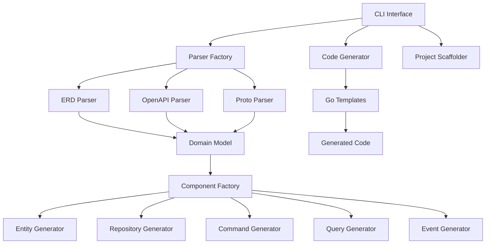

# Design Document

## Overview

The Pericarp CLI Generator is a command-line tool that enables developers to scaffold new Pericarp-based projects with automated code generation from various input formats. The tool follows a modular architecture with pluggable parsers and a factory-based code generation system.

The CLI will be built using the Cobra framework (already used in the existing demo) and will leverage Go's template system for code generation. The architecture emphasizes extensibility, allowing new input formats and generators to be added easily.

**Key Design Decisions:**
- **Installable via `go install`**: The CLI will be packaged as a standard Go binary installable from the main repository path
- **Plugin-like Parser Architecture**: Each input format (ERD, OpenAPI, Proto) implements a common `DomainParser` interface for extensibility
- **Factory Pattern for Code Generation**: A `ComponentFactory` interface ensures consistent code generation across all input formats
- **Template-based Generation**: Go templates provide flexibility and maintainability for code generation
- **Repository Cloning Support**: Integration with Git for cloning existing repositories and adding Pericarp capabilities

## Architecture

### High-Level Architecture



### Core Components

1. **CLI Interface**: Cobra-based command-line interface
2. **Parser System**: Pluggable parsers for different input formats
3. **Domain Model**: Standardized internal representation
4. **Component Factory**: Generates Pericarp components from domain model
5. **Template Engine**: Go templates for code generation
6. **Project Scaffolder**: Creates project structure and files

## Components and Interfaces

### CLI Structure

The CLI follows a hierarchical command structure with global flags for common options:

```go
// Main CLI commands structure
pericarp
├── new <project-name>           // Create new project (Requirement 2)
│   ├── --repo <git-url>        // Clone from repository (Requirement 4)
│   ├── --destination <path>    // Custom destination (Requirement 9)
│   ├── --dry-run              // Preview only (Requirement 9)
│   └── --verbose              // Debug output (Requirement 9)
├── generate                    // Generate code from specs (Requirement 3)
│   ├── --erd <file>           // From ERD (Requirement 3)
│   ├── --openapi <file>       // From OpenAPI (Requirement 3)
│   ├── --proto <file>         // From Proto (Requirement 3)
│   ├── --destination <path>   // Output directory (Requirement 9)
│   ├── --dry-run             // Preview only (Requirement 9)
│   └── --verbose             // Debug output (Requirement 9)
├── formats                    // List supported formats (Requirement 7)
├── version                   // Show version info
└── help                     // Show usage information (Requirement 1)
```

**Installation Design (Requirement 1):**
- The CLI will be located at `cmd/pericarp/main.go` in the repository
- Installable via `go install github.com/akeemphilbert/pericarp/cmd/pericarp`
- The binary will be named `pericarp` and available globally after installation

### Parser Interface

The parser system implements a plugin-like architecture (Requirement 7) with automatic format detection:

```go
// DomainParser defines the interface for parsing different input formats
type DomainParser interface {
    // Parse processes the input file and returns domain entities
    Parse(filePath string) (*DomainModel, error)
    
    // SupportedExtensions returns file extensions this parser handles
    SupportedExtensions() []string
    
    // FormatName returns the human-readable name of this format
    FormatName() string
    
    // Validate checks if the input file is valid for this parser
    Validate(filePath string) error
}

// ParserRegistry manages available parsers for extensibility
type ParserRegistry struct {
    parsers map[string]DomainParser
}

// RegisterParser adds a new parser to the registry
func (r *ParserRegistry) RegisterParser(parser DomainParser) {
    for _, ext := range parser.SupportedExtensions() {
        r.parsers[ext] = parser
    }
}

// GetParser returns the appropriate parser for a file extension
func (r *ParserRegistry) GetParser(filePath string) (DomainParser, error) {
    ext := filepath.Ext(filePath)
    if parser, exists := r.parsers[ext]; exists {
        return parser, nil
    }
    return nil, fmt.Errorf("no parser found for file extension: %s", ext)
}

// ListFormats returns all supported formats (Requirement 7)
func (r *ParserRegistry) ListFormats() []string {
    formats := make([]string, 0, len(r.parsers))
    seen := make(map[string]bool)
    for _, parser := range r.parsers {
        name := parser.FormatName()
        if !seen[name] {
            formats = append(formats, name)
            seen[name] = true
        }
    }
    return formats
}

// DomainModel represents the standardized internal model
type DomainModel struct {
    ProjectName string
    Entities    []Entity
    Relations   []Relation
    Metadata    map[string]interface{}
}

// Entity represents a domain entity with its properties
type Entity struct {
    Name        string
    Properties  []Property
    Methods     []Method
    Events      []string
    Metadata    map[string]interface{}
}

// Property represents an entity property
type Property struct {
    Name     string
    Type     string
    Required bool
    Tags     map[string]string
    Metadata map[string]interface{}
}

// Relation represents relationships between entities
type Relation struct {
    From         string
    To           string
    Type         RelationType
    Cardinality  string
    Metadata     map[string]interface{}
}

type RelationType string

const (
    OneToOne   RelationType = "one_to_one"
    OneToMany  RelationType = "one_to_many"
    ManyToMany RelationType = "many_to_many"
)
```

### Component Factory Interface

The factory pattern ensures consistent code generation across all input formats (Requirement 6):

```go
// ComponentFactory generates Pericarp components from domain model
type ComponentFactory interface {
    // GenerateEntity creates domain entity code following aggregate root patterns (Requirement 8)
    GenerateEntity(entity Entity) (*GeneratedFile, error)
    
    // GenerateRepository creates repository interface and implementation (Requirement 6, 8)
    GenerateRepository(entity Entity) ([]*GeneratedFile, error)
    
    // GenerateCommands creates CRUD command structures (Requirement 6)
    GenerateCommands(entity Entity) ([]*GeneratedFile, error)
    
    // GenerateQueries creates query structures and handlers (Requirement 6)
    GenerateQueries(entity Entity) ([]*GeneratedFile, error)
    
    // GenerateEvents creates domain events following standard structure (Requirement 6, 8)
    GenerateEvents(entity Entity) ([]*GeneratedFile, error)
    
    // GenerateHandlers creates command and query handlers with error handling (Requirement 6, 8)
    GenerateHandlers(entity Entity) ([]*GeneratedFile, error)
    
    // GenerateTests creates unit tests for all components (Requirement 8)
    GenerateTests(entity Entity) ([]*GeneratedFile, error)
    
    // GenerateProjectStructure creates the complete project scaffold (Requirement 2)
    GenerateProjectStructure(model *DomainModel, destination string) error
    
    // GenerateMakefile creates comprehensive Makefile (Requirement 5)
    GenerateMakefile(projectName string) (*GeneratedFile, error)
}

// PericarpComponentFactory implements ComponentFactory with Pericarp best practices
type PericarpComponentFactory struct {
    templateEngine *TemplateEngine
    logger         Logger
}

// NewPericarpComponentFactory creates a factory with proper template loading
func NewPericarpComponentFactory(templateDir string) (*PericarpComponentFactory, error) {
    engine, err := NewTemplateEngine(templateDir)
    if err != nil {
        return nil, fmt.Errorf("failed to initialize template engine: %w", err)
    }
    
    return &PericarpComponentFactory{
        templateEngine: engine,
        logger:         NewLogger(),
    }, nil
}

// GeneratedFile represents a generated code file
type GeneratedFile struct {
    Path     string
    Content  string
    Metadata map[string]interface{}
}
```

### Project Structure

The generated project will follow the established Pericarp conventions:

```
<project-name>/
├── go.mod
├── go.sum
├── Makefile
├── README.md
├── config.yaml.example
├── cmd/
│   └── <project-name>/
│       └── main.go
├── internal/
│   ├── application/
│   │   ├── commands.go
│   │   ├── queries.go
│   │   ├── handlers.go
│   │   └── projectors.go
│   ├── domain/
│   │   ├── <entity>.go
│   │   ├── <entity>_events.go
│   │   └── <entity>_test.go
│   └── infrastructure/
│       ├── repositories.go
│       └── <entity>_repository.go
├── pkg/
│   └── (shared packages if needed)
└── test/
    ├── fixtures/
    ├── integration/
    └── mocks/
```

## Data Models


### OpenAPI Parser Integration

The OpenAPI parser will extract entities from schema definitions:

```yaml
# Extract from OpenAPI spec
components:
  schemas:
    User:
      type: object
      required:
        - email
        - name
      properties:
        id:
          type: string
          format: uuid
        email:
          type: string
          format: email
        name:
          type: string
          minLength: 1
          maxLength: 100
        isActive:
          type: boolean
          default: true
```

### Protocol Buffer Integration

The Proto parser will extract entities from message definitions:

```protobuf
// user.proto
syntax = "proto3";

message User {
  string id = 1;
  string email = 2;
  string name = 3;
  bool is_active = 4;
}

message CreateUserRequest {
  string email = 1;
  string name = 2;
}
```

## Error Handling

### Error Types

Comprehensive error handling with clear messages and appropriate exit codes (Requirement 10):

```go
// Custom error types for better error handling
type CliError struct {
    Type    ErrorType
    Message string
    Cause   error
    Code    int  // Exit code for CLI
}

type ErrorType string

const (
    ValidationError   ErrorType = "validation"
    ParseError       ErrorType = "parse"
    GenerationError  ErrorType = "generation"
    FileSystemError  ErrorType = "filesystem"
    NetworkError     ErrorType = "network"
    ArgumentError    ErrorType = "argument"
)

// Error handling strategy with actionable messages
func (e *CliError) Error() string {
    if e.Cause != nil {
        return fmt.Sprintf("%s: %s (caused by: %v)", e.Type, e.Message, e.Cause)
    }
    return fmt.Sprintf("%s: %s", e.Type, e.Message)
}

// ExitCode returns the appropriate exit code for the error type
func (e *CliError) ExitCode() int {
    if e.Code != 0 {
        return e.Code
    }
    
    switch e.Type {
    case ArgumentError:
        return 2
    case ValidationError:
        return 3
    case ParseError:
        return 4
    case GenerationError:
        return 5
    case FileSystemError:
        return 6
    case NetworkError:
        return 7
    default:
        return 1
    }
}

// NewCliError creates a new CLI error with appropriate messaging
func NewCliError(errorType ErrorType, message string, cause error) *CliError {
    return &CliError{
        Type:    errorType,
        Message: message,
        Cause:   cause,
    }
}
```

### Error Recovery and User Guidance

- **Parse Errors**: Show specific line numbers and suggestions for ERD format issues (Requirement 10)
- **Validation Errors**: List all validation failures with actionable fixes (Requirement 10)
- **File System Errors**: Check permissions and suggest solutions with clear paths (Requirement 10)
- **Network Errors**: Retry logic for repository cloning with timeout handling (Requirement 4)
- **Missing Files**: Indicate exactly which files are needed and expected locations (Requirement 10)
- **Invalid Arguments**: Display helpful error messages with usage examples (Requirement 10)

### Validation Strategy

```go
// Validator provides comprehensive input validation
type Validator struct {
    logger Logger
}

// ValidateProjectName ensures project names follow Go module conventions
func (v *Validator) ValidateProjectName(name string) error {
    if name == "" {
        return NewCliError(ValidationError, "project name cannot be empty", nil)
    }
    
    if !regexp.MustCompile(`^[a-z][a-z0-9-]*$`).MatchString(name) {
        return NewCliError(ValidationError, 
            "project name must start with lowercase letter and contain only lowercase letters, numbers, and hyphens", 
            nil)
    }
    
    return nil
}

// ValidateInputFile checks if input files exist and are readable
func (v *Validator) ValidateInputFile(filePath string) error {
    if _, err := os.Stat(filePath); os.IsNotExist(err) {
        return NewCliError(FileSystemError, 
            fmt.Sprintf("input file does not exist: %s", filePath), 
            err)
    }
    
    return nil
}

// ValidateDestination ensures destination directory is writable
func (v *Validator) ValidateDestination(path string) error {
    if path == "" {
        return nil // Will use default
    }
    
    // Check if parent directory exists and is writable
    parent := filepath.Dir(path)
    if _, err := os.Stat(parent); os.IsNotExist(err) {
        return NewCliError(FileSystemError, 
            fmt.Sprintf("destination parent directory does not exist: %s", parent), 
            err)
    }
    
    return nil
}
```

## Testing Strategy

### Unit Tests

1. **Parser Tests**: Test each parser with valid/invalid inputs
2. **Factory Tests**: Test component generation with various entities
3. **Template Tests**: Test template rendering with different data
4. **CLI Tests**: Test command parsing and flag handling

### Integration Tests

1. **End-to-End Generation**: Full project generation from sample inputs
2. **Generated Code Compilation**: Ensure generated code compiles
3. **Generated Code Tests**: Run tests on generated projects
4. **Multiple Format Tests**: Test all supported input formats

### Test Structure

```go
// Example test structure
func TestERDParser(t *testing.T) {
    tests := []struct {
        name     string
        input    string
        expected *DomainModel
        wantErr  bool
    }{
        {
            name: "valid ERD with single entity",
            input: "testdata/simple_user.yaml",
            expected: &DomainModel{
                ProjectName: "user-service",
                Entities: []Entity{
                    {
                        Name: "User",
                        Properties: []Property{
                            {Name: "id", Type: "uuid.UUID", Required: true},
                            {Name: "email", Type: "string", Required: true},
                        },
                    },
                },
            },
            wantErr: false,
        },
        // More test cases...
    }
    
    parser := NewERDParser()
    for _, tt := range tests {
        t.Run(tt.name, func(t *testing.T) {
            result, err := parser.Parse(tt.input)
            if tt.wantErr {
                assert.Error(t, err)
                return
            }
            assert.NoError(t, err)
            assert.Equal(t, tt.expected, result)
        })
    }
}
```

### Generated Code Templates

The system will use Go templates for code generation:

#### Entity Template

```go
// templates/entity.go.tmpl
package domain

import (
    "errors"
    "github.com/google/uuid"
    "github.com/akeemphilbert/pericarp/pkg/domain"
)

// {{.Name}} represents a {{.Name | lower}} aggregate
type {{.Name}} struct {
    {{range .Properties}}{{.Name}} {{.Type}} `{{range $key, $value := .Tags}}{{$key}}:"{{$value}}" {{end}}`
    {{end}}
    version           int
    uncommittedEvents []domain.Event
}

// New{{.Name}} creates a new {{.Name | lower}} aggregate
func New{{.Name}}({{range $i, $prop := .RequiredProperties}}{{if $i}}, {{end}}{{$prop.Name}} {{$prop.Type}}{{end}}) (*{{.Name}}, error) {
    {{range .RequiredProperties}}if {{.Name}} == {{.ZeroValue}} {
        return nil, errors.New("{{.Name}} cannot be empty")
    }
    {{end}}

    {{.Name | lower}} := &{{.Name}}{
        {{range .Properties}}{{.Name}}: {{if .Required}}{{.Name}}{{else}}{{.DefaultValue}}{{end}},
        {{end}}
        version: 1,
        uncommittedEvents: make([]domain.Event, 0),
    }

    event := New{{.Name}}CreatedEvent({{range $i, $prop := .Properties}}{{if $i}}, {{end}}{{.Name | lower}}.{{$prop.Name}}{{end}})
    {{.Name | lower}}.recordEvent(event)

    return {{.Name | lower}}, nil
}

// GetID returns the {{.Name | lower}}'s GetID as a string
func ({{.Name | lower | slice 0 1}} *{{.Name}}) ID() string {
    return {{.Name | lower | slice 0 1}}.id.String()
}

// Version returns the current version of the aggregate
func ({{.Name | lower | slice 0 1}} *{{.Name}}) Version() int {
    return {{.Name | lower | slice 0 1}}.version
}

// UncommittedEvents returns uncommitted events
func ({{.Name | lower | slice 0 1}} *{{.Name}}) UncommittedEvents() []domain.Event {
    return {{.Name | lower | slice 0 1}}.uncommittedEvents
}

// MarkEventsAsCommitted clears uncommitted events
func ({{.Name | lower | slice 0 1}} *{{.Name}}) MarkEventsAsCommitted() {
    {{.Name | lower | slice 0 1}}.uncommittedEvents = make([]domain.Event, 0)
}

// LoadFromHistory reconstructs aggregate from events
func ({{.Name | lower | slice 0 1}} *{{.Name}}) LoadFromHistory(events []domain.Event) {
    for _, event := range events {
        {{.Name | lower | slice 0 1}}.applyEvent(event)
        {{.Name | lower | slice 0 1}}.version = event.Version()
    }
}

{{range .Methods}}
// {{.Name}} {{.Description}}
func ({{$.Name | lower | slice 0 1}} *{{$.Name}}) {{.Name}}({{range $i, $param := .Parameters}}{{if $i}}, {{end}}{{$param.Name}} {{$param.Type}}{{end}}) error {
    // Implementation will be generated based on method type
    {{.Implementation}}
}
{{end}}

// recordEvent adds an event to uncommitted events
func ({{.Name | lower | slice 0 1}} *{{.Name}}) recordEvent(event domain.Event) {
    {{.Name | lower | slice 0 1}}.uncommittedEvents = append({{.Name | lower | slice 0 1}}.uncommittedEvents, event)
}

// applyEvent applies an event to aggregate state
func ({{.Name | lower | slice 0 1}} *{{.Name}}) applyEvent(event domain.Event) {
    switch e := event.(type) {
    {{range .Events}}case {{.}}:
        // Apply {{.}} event
        {{.ApplyLogic}}
    {{end}}
    }
}
```

#### Repository Template

```go
// templates/repository.go.tmpl
package domain

import (
    "context"
    "github.com/google/uuid"
)

// {{.Name}}Repository defines the repository interface for {{.Name | lower}}s
type {{.Name}}Repository interface {
    Save(ctx context.Context, {{.Name | lower}} *{{.Name}}) error
    Load(ctx context.Context, id uuid.UUID) (*{{.Name}}, error)
    {{range .QueryMethods}}{{.Name}}(ctx context.Context{{range .Parameters}}, {{.Name}} {{.Type}}{{end}}) ({{.ReturnType}}, error)
    {{end}}
}
```

#### Command Template

```go
// templates/commands.go.tmpl
package application

import (
    "github.com/google/uuid"
)

{{range .Commands}}
// {{.Name}} represents a command to {{.Description}}
type {{.Name}} struct {
    {{range .Properties}}{{.Name}} {{.Type}} `json:"{{.Name | snake_case}}"{{if .Validation}} validate:"{{.Validation}}"{{end}}`
    {{end}}
}

// CommandType returns the command type identifier
func (c {{.Name}}) CommandType() string {
    return "{{.Name}}"
}

// Validate validates the command data
func (c {{.Name}}) Validate() error {
    {{range .Properties}}{{if .Required}}if c.{{.Name}} == {{.ZeroValue}} {
        return errors.New("{{.Name | snake_case}} is required")
    }
    {{end}}{{end}}
    return nil
}
{{end}}
```

### Makefile Template

The generated Makefile includes all required targets (Requirement 5) with comprehensive development workflow support:

```makefile
# Generated Makefile for {{.ProjectName}}

.PHONY: help build test clean deps fmt lint security gosec

help: ## Show this help message
	@echo 'Usage: make [target]'
	@echo ''
	@echo 'Targets:'
	@awk 'BEGIN {FS = ":.*?## "} /^[a-zA-Z_-]+:.*?## / {printf "  %-15s %s\n", $1, $2}' $(MAKEFILE_LIST)

# Dependencies (Requirement 5)
deps: ## Install dependencies
	go mod download
	go mod tidy

# Build (Requirement 5)
build: ## Build the application
	go build -v ./...

build-cmd: ## Build the main command
	go build -o bin/{{.ProjectName}} ./cmd/{{.ProjectName}}

# Testing (Requirement 5)
test: ## Run all tests
	go test -v -race -coverprofile=coverage.out ./...

test-unit: ## Run unit tests only
	go test -v -race ./internal/domain/... ./internal/application/...

test-integration: ## Run integration tests
	go test -v -tags=integration ./test/integration/...

coverage: ## Generate coverage report
	go test -v -race -coverprofile=coverage.out ./...
	go tool cover -html=coverage.out -o coverage.html

# Code quality (Requirement 5)
fmt: ## Format code
	go fmt ./...

lint: ## Run linter (Requirement 5)
	golangci-lint run

# Security (Requirement 5)
gosec: ## Run security scan
	gosec ./...

security: gosec ## Alias for gosec

# Development workflow
dev-setup: deps ## Set up development environment
	@echo "Development environment ready!"

dev-test: fmt lint test ## Run complete development workflow

# Clean (Requirement 5)
clean: ## Clean build artifacts
	rm -rf bin/
	rm -f coverage.out coverage.html
	go clean -testcache

# Database (if applicable)
{{if .HasDatabase}}
db-migrate: ## Run database migrations
	go run ./cmd/{{.ProjectName}} migrate

db-reset: ## Reset database
	rm -f *.db
	$(MAKE) db-migrate
{{end}}

# Additional targets for Pericarp projects
validate-architecture: ## Validate DDD architecture
	@echo "Validating domain-driven design architecture..."
	@go test -v ./internal/domain/... -tags=architecture

performance-test: ## Run performance benchmarks
	go test -bench=. -benchmem ./...

mock-generate: ## Generate mocks for testing
	go generate ./...
```

### Dry-Run and Verbose Output Support

The CLI implements comprehensive preview and debugging capabilities (Requirement 9):

```go
// DryRunExecutor handles preview mode without file creation
type DryRunExecutor struct {
    logger Logger
}

// Execute shows what would be generated without creating files
func (d *DryRunExecutor) Execute(files []*GeneratedFile, destination string) error {
    d.logger.Info("DRY RUN MODE - No files will be created")
    d.logger.Info(fmt.Sprintf("Target destination: %s", destination))
    
    for _, file := range files {
        d.logger.Info(fmt.Sprintf("Would create: %s", file.Path))
        if d.logger.IsVerbose() {
            d.logger.Debug("File content preview:")
            d.logger.Debug(d.truncateContent(file.Content, 500))
        }
    }
    
    return nil
}

// VerboseLogger provides detailed output for debugging
type VerboseLogger struct {
    verbose bool
    writer  io.Writer
}

// SetVerbose enables verbose logging with debug output to stdout
func (v *VerboseLogger) SetVerbose(enabled bool) {
    v.verbose = enabled
    if enabled {
        v.writer = os.Stdout
    }
}

// Debug outputs debug information when verbose mode is enabled
func (v *VerboseLogger) Debug(message string) {
    if v.verbose {
        fmt.Fprintf(v.writer, "[DEBUG] %s\n", message)
    }
}
```

### Repository Integration

Support for cloning existing repositories and adding Pericarp capabilities (Requirement 4):

```go
// RepositoryCloner handles Git repository operations
type RepositoryCloner struct {
    logger Logger
}

// CloneRepository clones a Git repository to the specified destination
func (r *RepositoryCloner) CloneRepository(repoURL, destination string) error {
    r.logger.Info(fmt.Sprintf("Cloning repository: %s", repoURL))
    
    cmd := exec.Command("git", "clone", repoURL, destination)
    cmd.Stdout = r.logger.Writer()
    cmd.Stderr = r.logger.Writer()
    
    if err := cmd.Run(); err != nil {
        return NewCliError(NetworkError, 
            fmt.Sprintf("failed to clone repository %s", repoURL), 
            err)
    }
    
    r.logger.Info("Repository cloned successfully")
    return nil
}

// ValidateRepository checks if the cloned repository is valid
func (r *RepositoryCloner) ValidateRepository(path string) error {
    // Check if it's a valid Git repository
    if _, err := os.Stat(filepath.Join(path, ".git")); os.IsNotExist(err) {
        return NewCliError(ValidationError, 
            "cloned directory is not a valid Git repository", 
            err)
    }
    
    return nil
}

// PreserveExistingFiles ensures existing files are not overwritten
func (r *RepositoryCloner) PreserveExistingFiles(destination string, newFiles []*GeneratedFile) ([]*GeneratedFile, error) {
    var safeFiles []*GeneratedFile
    
    for _, file := range newFiles {
        fullPath := filepath.Join(destination, file.Path)
        if _, err := os.Stat(fullPath); os.IsNotExist(err) {
            safeFiles = append(safeFiles, file)
        } else {
            r.logger.Warn(fmt.Sprintf("Skipping existing file: %s", file.Path))
        }
    }
    
    return safeFiles, nil
}
```

### CLI Command Structure

Complete command implementation with all required flags and validation:

```go
// RootCmd represents the base command when called without any subcommands
var RootCmd = &cobra.Command{
    Use:   "pericarp",
    Short: "Pericarp CLI Generator for scaffolding DDD projects",
    Long: `Pericarp CLI Generator enables developers to scaffold new Pericarp-based projects
with automated code generation from various input formats including ERD, OpenAPI, and Protocol Buffers.`,
    Run: func(cmd *cobra.Command, args []string) {
        // Show help when no command is provided (Requirement 1)
        cmd.Help()
    },
}

// NewCmd creates a new Pericarp project
var NewCmd = &cobra.Command{
    Use:   "new <project-name>",
    Short: "Create a new Pericarp project",
    Args:  cobra.ExactArgs(1),
    RunE: func(cmd *cobra.Command, args []string) error {
        projectName := args[0]
        
        // Validate project name (Requirement 10)
        validator := NewValidator()
        if err := validator.ValidateProjectName(projectName); err != nil {
            return err
        }
        
        // Handle flags (Requirement 9)
        repoURL, _ := cmd.Flags().GetString("repo")
        destination, _ := cmd.Flags().GetString("destination")
        dryRun, _ := cmd.Flags().GetBool("dry-run")
        verbose, _ := cmd.Flags().GetBool("verbose")
        
        // Set up logging
        logger := NewLogger()
        logger.SetVerbose(verbose)
        
        // Execute project creation
        creator := NewProjectCreator(logger)
        return creator.CreateProject(projectName, repoURL, destination, dryRun)
    },
}

// GenerateCmd generates code from various input formats
var GenerateCmd = &cobra.Command{
    Use:   "generate",
    Short: "Generate Pericarp code from specifications",
    RunE: func(cmd *cobra.Command, args []string) error {
        // Get input format flags (Requirement 3)
        erdFile, _ := cmd.Flags().GetString("erd")
        openAPIFile, _ := cmd.Flags().GetString("openapi")
        protoFile, _ := cmd.Flags().GetString("proto")
        
        // Validate that exactly one input format is provided
        inputCount := 0
        var inputFile, inputType string
        
        if erdFile != "" {
            inputCount++
            inputFile = erdFile
            inputType = "erd"
        }
        if openAPIFile != "" {
            inputCount++
            inputFile = openAPIFile
            inputType = "openapi"
        }
        if protoFile != "" {
            inputCount++
            inputFile = protoFile
            inputType = "proto"
        }
        
        if inputCount == 0 {
            return NewCliError(ArgumentError, 
                "must specify exactly one input format (--erd, --openapi, or --proto)", 
                nil)
        }
        if inputCount > 1 {
            return NewCliError(ArgumentError, 
                "cannot specify multiple input formats simultaneously", 
                nil)
        }
        
        // Handle other flags (Requirement 9)
        destination, _ := cmd.Flags().GetString("destination")
        dryRun, _ := cmd.Flags().GetBool("dry-run")
        verbose, _ := cmd.Flags().GetBool("verbose")
        
        // Set up logging
        logger := NewLogger()
        logger.SetVerbose(verbose)
        
        // Execute code generation
        generator := NewCodeGenerator(logger)
        return generator.Generate(inputFile, inputType, destination, dryRun)
    },
}

// FormatsCmd lists supported input formats
var FormatsCmd = &cobra.Command{
    Use:   "formats",
    Short: "List supported input formats",
    RunE: func(cmd *cobra.Command, args []string) error {
        registry := NewParserRegistry()
        formats := registry.ListFormats()
        
        fmt.Println("Supported input formats:")
        for _, format := range formats {
            fmt.Printf("  - %s\n", format)
        }
        
        return nil
    },
}

func init() {
    // Add flags to NewCmd (Requirement 9)
    NewCmd.Flags().String("repo", "", "Git repository URL to clone")
    NewCmd.Flags().String("destination", "", "Custom destination directory")
    NewCmd.Flags().Bool("dry-run", false, "Preview changes without creating files")
    NewCmd.Flags().Bool("verbose", false, "Enable verbose output")
    
    // Add flags to GenerateCmd (Requirement 3, 9)
    GenerateCmd.Flags().String("erd", "", "ERD input file")
    GenerateCmd.Flags().String("openapi", "", "OpenAPI specification file")
    GenerateCmd.Flags().String("proto", "", "Protocol Buffer definition file")
    GenerateCmd.Flags().String("destination", "", "Output directory")
    GenerateCmd.Flags().Bool("dry-run", false, "Preview changes without creating files")
    GenerateCmd.Flags().Bool("verbose", false, "Enable verbose output")
    
    // Add commands to root
    RootCmd.AddCommand(NewCmd)
    RootCmd.AddCommand(GenerateCmd)
    RootCmd.AddCommand(FormatsCmd)
}
```

## Summary

This design provides a comprehensive foundation for the Pericarp CLI Generator that addresses all requirements:

- **Installation Support** (Req 1): Standard Go binary installable via `go install`
- **Project Creation** (Req 2): Complete project scaffolding with proper Go module structure
- **Multi-Format Generation** (Req 3): Extensible parser system for ERD, OpenAPI, and Proto
- **Repository Integration** (Req 4): Git cloning with existing file preservation
- **Comprehensive Makefile** (Req 5): All required targets for development workflow
- **Factory Pattern** (Req 6): Consistent code generation across input formats
- **Extensible Architecture** (Req 7): Plugin-like parser registration system
- **Best Practices** (Req 8): Pericarp conventions with proper error handling and testing
- **CLI Control** (Req 9): Dry-run, verbose, and destination flags
- **Error Handling** (Req 10): Clear messages, validation, and appropriate exit codes

The template-based approach ensures consistent code generation while maintaining flexibility for different input formats and future extensibility.