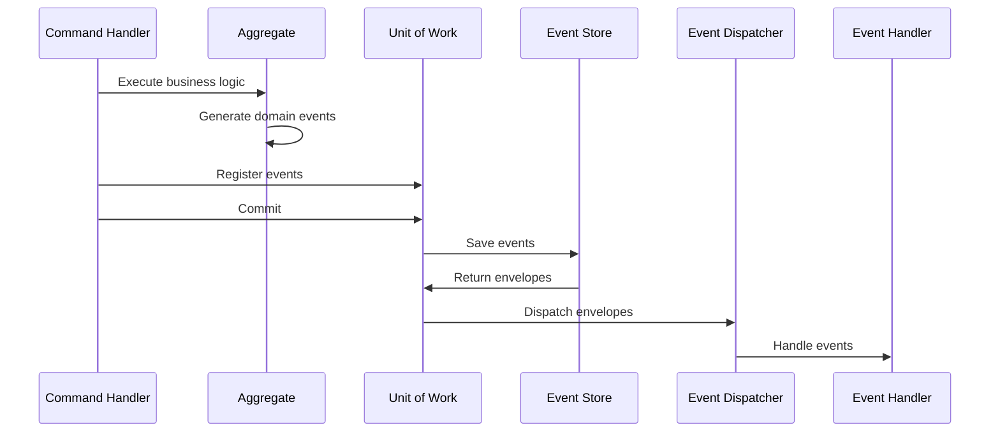

# Design Document

## Overview

Pericarp is a Go library implementing Domain-Driven Design (DDD), Command Query Responsibility Segregation (CQRS), and Event Sourcing patterns. The library provides a clean, layered architecture that enables developers to build scalable server applications with clear separation of concerns. The design follows the Persist-then-Dispatch pattern for event handling and maintains domain purity by isolating infrastructure concerns.

## Architecture

The library follows a three-layer DDD architecture:

```
┌─────────────────────────────────────────┐
│           Application Layer             │
│  - Command Handlers                     │
│  - Query Handlers                       │
│  - Event Handlers (Projectors/Sagas)   │
└─────────────────────────────────────────┘
┌─────────────────────────────────────────┐
│             Domain Layer                │
│  - Aggregates                          │
│  - Value Objects                       │
│  - Domain Services                     │
│  - Repository Interfaces               │
│  - Domain Events                       │
└─────────────────────────────────────────┘
┌─────────────────────────────────────────┐
│          Infrastructure Layer           │
│  - Event Store (GORM)                  │
│  - Event Dispatcher (Watermill)        │
│  - Repository Implementations          │
│  - DTOs                                │
│  - Platform (Logger, Config)           │
└─────────────────────────────────────────┘
```

### Package Structure

Following standard Go project layout:

```
pericarp/
├── cmd/                    # Demo applications
│   └── demo/
├── pkg/                    # Public library code
│   ├── domain/            # Domain layer
│   ├── application/       # Application layer
│   └── infrastructure/    # Infrastructure layer
├── internal/              # Private library code
├── examples/              # Example usage
├── docs/                  # Documentation
└── scripts/               # Build and utility scripts
```

## Components and Interfaces

### Core Domain Interfaces

```go
// Logger interface for structured logging
type Logger interface {
    Debug(msg string, keysAndValues ...interface{})
    Debugf(format string, args ...interface{})
    Info(msg string, keysAndValues ...interface{})
    Infof(format string, args ...interface{})
    Warn(msg string, keysAndValues ...interface{})
    Warnf(format string, args ...interface{})
    Error(msg string, keysAndValues ...interface{})
    Errorf(format string, args ...interface{})
    Fatal(msg string, keysAndValues ...interface{})
    Fatalf(format string, args ...interface{})
}

// Event represents a domain event
type Event interface {
    EventType() string
    AggregateID() string
    Version() int
    OccurredAt() time.Time
}

// Envelope wraps events with metadata
type Envelope interface {
    Event() Event
    Metadata() map[string]interface{}
    EventID() string
    Timestamp() time.Time
}

// EventStore handles event persistence
type EventStore interface {
    Save(ctx context.Context, events []Event) ([]Envelope, error)
    Load(ctx context.Context, aggregateID string) ([]Envelope, error)
    LoadFromVersion(ctx context.Context, aggregateID string, version int) ([]Envelope, error)
}

// EventDispatcher handles event distribution
type EventDispatcher interface {
    Dispatch(ctx context.Context, envelopes []Envelope) error
    Subscribe(eventType string, handler EventHandler) error
}

// UnitOfWork manages transactional event persistence
type UnitOfWork interface {
    RegisterEvents(events []Event)
    Commit(ctx context.Context) ([]Envelope, error)
    Rollback() error
}
```

### Application Layer Components

```go
// CommandHandler processes commands with logger injection
type CommandHandler[T Command] interface {
    Handle(ctx context.Context, logger Logger, cmd T) error
}

// QueryHandler processes queries with logger injection
type QueryHandler[T Query, R any] interface {
    Handle(ctx context.Context, logger Logger, query T) (R, error)
}

// EventHandler processes events (projectors/sagas)
type EventHandler interface {
    Handle(ctx context.Context, envelope Envelope) error
    EventTypes() []string
}

// Command marker interface
type Command interface {
    CommandType() string
}

// Query marker interface
type Query interface {
    QueryType() string
}

// Middleware for AOP-like cross-cutting concerns
type CommandMiddleware func(next CommandHandlerFunc) CommandHandlerFunc
type QueryMiddleware func(next QueryHandlerFunc) QueryHandlerFunc

type CommandHandlerFunc func(ctx context.Context, logger Logger, cmd Command) error
type QueryHandlerFunc func(ctx context.Context, logger Logger, query Query) (interface{}, error)

// CommandBus with middleware support and logger injection
type CommandBus interface {
    Use(middleware ...CommandMiddleware)
    Handle(ctx context.Context, logger Logger, cmd Command) error
    Register(cmdType string, handler CommandHandler[Command])
}

// QueryBus with middleware support and logger injection
type QueryBus interface {
    Use(middleware ...QueryMiddleware)
    Handle(ctx context.Context, logger Logger, query Query) (interface{}, error)
    Register(queryType string, handler QueryHandler[Query, interface{}])
}
```

### Domain Layer Components

```go
// AggregateRoot base for domain aggregates
type AggregateRoot interface {
    ID() string
    Version() int
    UncommittedEvents() []Event
    MarkEventsAsCommitted()
    LoadFromHistory(events []Event)
}

// Repository interface for aggregate persistence
type Repository[T AggregateRoot] interface {
    Save(ctx context.Context, aggregate T) error
    Load(ctx context.Context, id string) (T, error)
}

// DomainService for domain logic that doesn't belong to aggregates
type DomainService interface {
    // Domain-specific methods
}
```

## Data Models

### Event Storage Schema

Using GORM for event persistence with the following schema:

```go
type EventRecord struct {
    ID          string    `gorm:"primaryKey"`
    AggregateID string    `gorm:"index"`
    EventType   string    `gorm:"index"`
    Version     int       `gorm:"index"`
    Data        string    `gorm:"type:text"` // JSON serialized event
    Metadata    string    `gorm:"type:text"` // JSON serialized metadata
    Timestamp   time.Time `gorm:"index"`
    CreatedAt   time.Time
}
```

### Configuration Models

```go
type Config struct {
    Database DatabaseConfig `mapstructure:"database"`
    Events   EventsConfig   `mapstructure:"events"`
    Logging  LoggingConfig  `mapstructure:"logging"`
}

type DatabaseConfig struct {
    Driver string `mapstructure:"driver"` // sqlite, postgres
    DSN    string `mapstructure:"dsn"`
}

type EventsConfig struct {
    Publisher string `mapstructure:"publisher"` // channel, pubsub
}
```

## Error Handling

### Error Types

```go
// Domain errors
type DomainError struct {
    Code    string
    Message string
    Cause   error
}

// Application errors
type ValidationError struct {
    Field   string
    Message string
}

type ConcurrencyError struct {
    AggregateID string
    Expected    int
    Actual      int
}

// Infrastructure errors
type PersistenceError struct {
    Operation string
    Cause     error
}
```

### Error Handling Strategy

1. **Domain Layer**: Returns domain-specific errors without infrastructure details
2. **Application Layer**: Translates domain errors to application errors, handles validation
3. **Infrastructure Layer**: Wraps infrastructure errors with context, handles retries and circuit breaking

## Testing Strategy

### BDD Testing with Cucumber
- Use Cucumber for behavior-driven development with Gherkin scenarios
- Follow best practices from https://automationpanda.com/2017/01/30/bdd-101-writing-good-gherkin/
- Write scenarios that focus on business behavior rather than implementation details

### Test Levels
- **BDD/Acceptance Tests**: Cucumber scenarios testing end-to-end behavior
- **Unit Testing**: Pure unit tests for domain logic and individual components
- **Integration Testing**: Test infrastructure components with real dependencies

### Test Structure
```go
// Domain tests - no external dependencies
func TestAggregate_BusinessLogic(t *testing.T) {
    // Pure unit tests
}

// Application tests - with mocks generated by moq
func TestCommandHandler_Handle(t *testing.T) {
    // Use moq-generated mocks for repositories and services
    mockRepo := &RepositoryMock{}
    // Configure mock behavior and test handler
}

// Infrastructure tests - with test containers
func TestEventStore_Save(t *testing.T) {
    // Use testcontainers for database testing
}
```

### BDD Scenario Examples
```gherkin
Feature: User Management
  As a system administrator
  I want to manage users in the system
  So that I can control access and maintain user data

  Scenario: Creating a new user
    Given the system is running
    When I create a user with email "john@example.com"
    Then the user should be created successfully
    And a UserCreated event should be published
    And the user should appear in the read model

  Scenario: Updating user email
    Given a user exists with email "john@example.com"
    When I update the user's email to "john.doe@example.com"
    Then the email should be updated successfully
    And a UserEmailUpdated event should be published
    And the read model should reflect the new email
```

### Testing Utilities
- In-memory implementations for testing
- Test fixtures for common scenarios
- Custom assertions without external frameworks
- Use moq (https://github.com/matryer/moq) for generating mocks from interfaces
- Cucumber step definitions for BDD scenarios

## Implementation Details

### Event Sourcing Flow



### Middleware Examples

```go
// Logging middleware for commands (logger is now injected via bus)
func LoggingCommandMiddleware() CommandMiddleware {
    return func(next CommandHandlerFunc) CommandHandlerFunc {
        return func(ctx context.Context, logger Logger, cmd Command) error {
            start := time.Now()
            logger.Info("Executing command", "type", cmd.CommandType())
            
            err := next(ctx, logger, cmd)
            
            duration := time.Since(start)
            if err != nil {
                logger.Error("Command failed", "type", cmd.CommandType(), "duration", duration, "error", err)
            } else {
                logger.Info("Command completed", "type", cmd.CommandType(), "duration", duration)
            }
            
            return err
        }
    }
}

// Validation middleware for commands
func ValidationCommandMiddleware() CommandMiddleware {
    return func(next CommandHandlerFunc) CommandHandlerFunc {
        return func(ctx context.Context, logger Logger, cmd Command) error {
            if validator, ok := cmd.(Validator); ok {
                if err := validator.Validate(); err != nil {
                    logger.Warn("Command validation failed", "type", cmd.CommandType(), "error", err)
                    return ValidationError{Message: err.Error()}
                }
            }
            return next(ctx, logger, cmd)
        }
    }
}

// Metrics middleware for queries
func MetricsQueryMiddleware(metrics MetricsCollector) QueryMiddleware {
    return func(next QueryHandlerFunc) QueryHandlerFunc {
        return func(ctx context.Context, logger Logger, query Query) (interface{}, error) {
            start := time.Now()
            result, err := next(ctx, logger, query)
            duration := time.Since(start)
            
            metrics.RecordQueryDuration(query.QueryType(), duration)
            if err != nil {
                metrics.IncrementQueryErrors(query.QueryType())
                logger.Error("Query failed", "type", query.QueryType(), "duration", duration, "error", err)
            } else {
                logger.Debug("Query completed", "type", query.QueryType(), "duration", duration)
            }
            
            return result, err
        }
    }
}
```

### Dependency Injection with Fx

```go
var Module = fx.Options(
    fx.Provide(
        NewEventStore,
        NewEventDispatcher,
        NewUnitOfWork,
        NewCommandBus,
        NewQueryBus,
        NewLogger,
        // Command handlers
        NewCreateUserHandler,
        // Query handlers
        NewGetUserHandler,
        // Event handlers
        NewUserProjector,
        // Middleware
        NewLoggingMiddleware,
        NewValidationMiddleware,
        NewMetricsMiddleware,
    ),
)
```

### Configuration with Viper

```go
func LoadConfig() (*Config, error) {
    viper.SetConfigName("config")
    viper.SetConfigType("yaml")
    viper.AddConfigPath(".")
    viper.AddConfigPath("./configs")
    
    // Environment variable support
    viper.AutomaticEnv()
    viper.SetEnvPrefix("PERICARP")
    
    var config Config
    if err := viper.ReadInConfig(); err != nil {
        return nil, err
    }
    
    return &config, viper.Unmarshal(&config)
}
```

### Performance Considerations

1. **JSON Serialization**: Use standard library encoding/json for event serialization
2. **Connection Pooling**: Configure GORM with appropriate connection pool settings
3. **Event Batching**: Process events in batches to reduce database round trips
4. **Indexing**: Proper database indexes on aggregate_id, event_type, and version
5. **Memory Management**: Avoid reflection in hot paths, use concrete types where possible

### Database Support

#### SQLite Configuration
```go
dsn := "file:events.db?cache=shared&mode=rwc"
db, err := gorm.Open(sqlite.Open(dsn), &gorm.Config{})
```

#### PostgreSQL Configuration
```go
dsn := "host=localhost user=user password=pass dbname=events port=5432 sslmode=disable"
db, err := gorm.Open(postgres.Open(dsn), &gorm.Config{})
```

## Demo Application

The demo will showcase:

1. **User Management Aggregate**: Create, update user operations
2. **CQRS Implementation**: Separate command and query models
3. **Event Sourcing**: User events persisted and replayed
4. **Event Handlers**: User projection for read models
5. **Database Flexibility**: Configuration for SQLite and PostgreSQL

### Demo Commands
- `CreateUser`: Creates a new user aggregate
- `UpdateUserEmail`: Updates user email address

### Demo Queries
- `GetUser`: Retrieves user by ID from read model
- `ListUsers`: Lists all users with pagination

### Demo Events
- `UserCreated`: Fired when user is created
- `UserEmailUpdated`: Fired when email is updated

### Demo Middleware Configuration
```go
// Configure command bus with middleware (logger injected via Handle method)
commandBus.Use(
    LoggingCommandMiddleware(),
    ValidationCommandMiddleware(),
    MetricsCommandMiddleware(metrics),
)

// Configure query bus with middleware (logger injected via Handle method)
queryBus.Use(
    LoggingQueryMiddleware(),
    CachingQueryMiddleware(cache),
    MetricsQueryMiddleware(metrics),
)

// Usage example
logger := NewLogger()
cmd := CreateUserCommand{Email: "user@example.com"}
err := commandBus.Handle(ctx, logger, cmd)
```