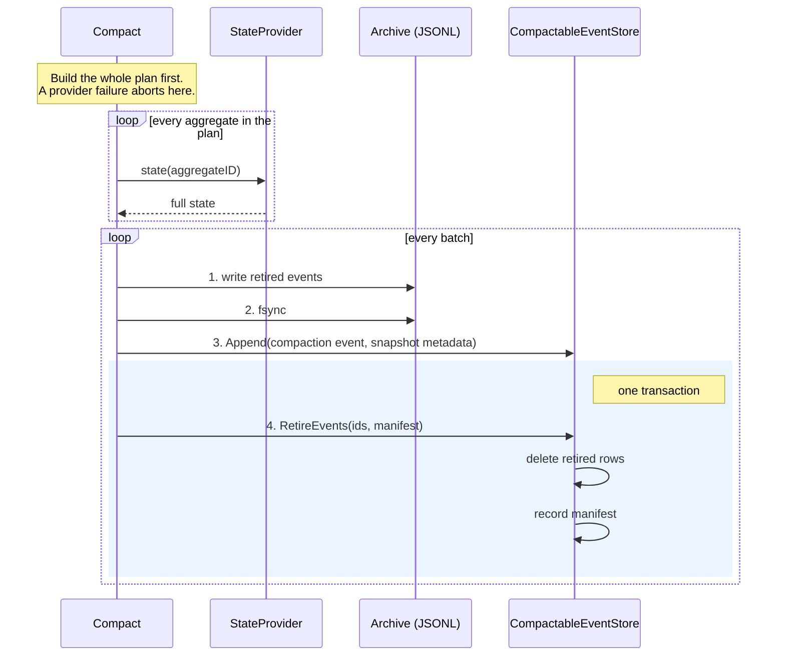
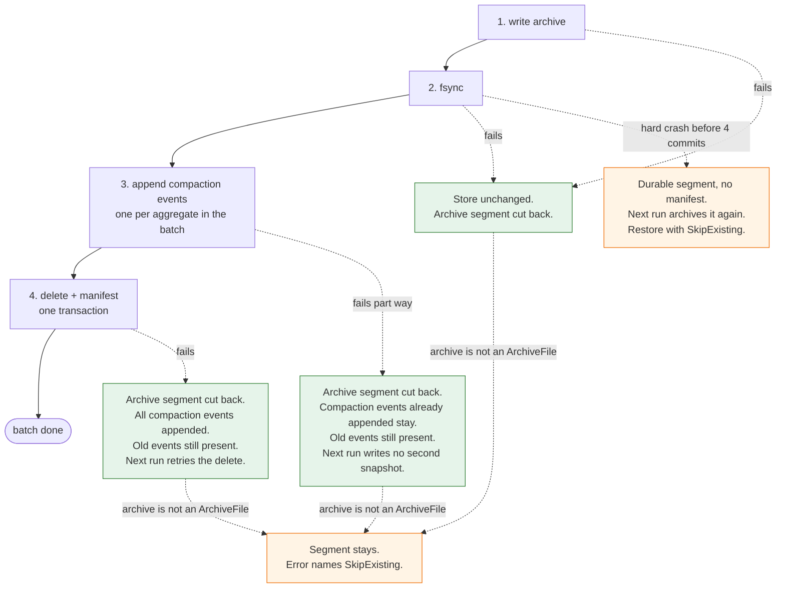
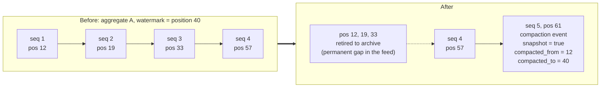

# 0011. Compaction archives, fsyncs, appends the snapshot, and only then deletes

## Context and problem statement

An event store grows without bound. Compaction collapses history at or below a
watermark into one full-state event per aggregate and moves the retired events out
of the store. The operation deletes from the source of truth
([0001](0001-event-sourcing-append-contract.md)), so the questions were: in what
order do the writes happen so that no failure at any point loses an event; how does
a compacted aggregate replay when its history now starts mid-sequence; and which
stores may do it at all.

## Decision drivers

- Every failure before the delete must leave the store exactly as it was; every
  delete must happen with the archive already durable.
- Positions retired from the global feed must never be reused
  ([0007](0007-global-ordered-event-feed.md)) — a subscriber may have consumed
  them.
- A second run must resume, not repeat, and must not stack snapshot on snapshot.
- Replay must accept a history that begins at a snapshot, without loosening the
  no-gaps rule for ordinary events.
- The archive must be importable by the migration tool
  ([0009](0009-event-store-migration-via-portable-file.md)).

## Considered options

1. **Per batch: write archive → fsync → append the compaction event(s) → delete
   the retired events and record a manifest in one transaction.** Stores opt in
   via `CompactableEventStore`.
2. **Snapshot table beside the events** — events are never deleted; replay starts
   from the latest snapshot row.
3. **Delete first, archive after** — smaller store sooner; archive on best effort.

## Decision outcome

Chosen option: **option 1**. The ordering is the whole safety argument. Because
the archive is fsynced before the compaction event is appended, and the delete is
last and transactional with the manifest, there is no point at which an event
exists in neither the store nor a durable archive. The whole plan — including
every `StateProvider` call — is built before the first write, so a provider failure
aborts with nothing archived and nothing appended.

Every failure the process survives — a write, the fsync, an append, the delete —
returns through `rollbackArchive`, which truncates the archive back to where the
batch began. What each failure leaves behind:

The rollback needs the archive to implement `ArchiveFile` (`Truncate`); an
`*os.File` does, a plain `io.Writer` does not, and then the segment stays and the
error says to restore with `SkipExisting`.

One aggregate, before and after, showing the permanent gap and the snapshot at
`max + 1`. Event `seq 4` sits above the watermark and survives; the snapshot still
carries the state as of now, including `seq 4`, because replay applies the
compaction event last:

The decisions that hang off the ordering:

- **Positions are never reused.** Deleting rows made `MAX(position)+1` fall back
  and re-issue a consumed position; both compactable stores now keep a high-water
  mark that only rises (the GORM store takes the max of the events table *and*
  the recorded manifests).
- **A compaction event declares itself a snapshot** (`domain.MetadataSnapshot`).
  Replay accepts a *declared snapshot* above the sequence it expected, because a
  snapshot's payload already folds in everything it replaced. An ordinary event
  that skips is still refused; a snapshot may not go backwards. This replaced an
  earlier, weaker relaxation ("any first event") that a type-based `Retain` could
  defeat by keeping an event with compacted history above it.
- **Two re-run rules.** An aggregate whose only candidates are a previous run's
  compaction events is skipped; an aggregate whose last event already compacts to
  this watermark gets no second snapshot. Together they make the retry after a
  failed delete converge.
- **The archive is the migration format.** It reuses `migration.FormatVersion` and
  is resumable; the header is decided by probing whether the destination is empty
  (the `ArchiveFile` capability), not by `FromPosition`, which put a second header
  mid-file on a manifest-driven resume. A batch that fails after its bytes are
  fsynced is rolled back off the end of the archive, so no segment survives that a
  manifest does not account for.
- **Only stores with a transaction may compact.** `MemoryStore` and
  `GormEventStore` implement `CompactableEventStore`; `FileStore` and
  `DynamoEventStore` are refused before a single event is read
  ([0006](0006-optional-store-capabilities-are-declared-and-refused.md)).

Option 2 does not reduce the store, which was the point. Option 3 has a window in
which an event exists nowhere.

### Consequences

- Good: no failure short of a hard crash between the fsync and the delete's
  commit can lose an event, and that window is documented in the package doc
  with `SkipExisting` named as the restore default.
- Good: the contract was written first — a 42-pickle godog suite committed before
  any implementation, run per store kind against real stores, with an observing
  wrapper that records the write/sync/append/delete order so the ordering is
  proved, not asserted.
- Bad: a retired position is a permanent gap in the global feed; consumers that
  assume dense positions will be surprised.
- Bad: a straddling aggregate is snapshotted as it stands *now*, including events
  above the watermark, because the compaction event is applied last on replay.
  That is correct but not obvious.
- Neutral: `Retain` is a hook only — the retention policy belongs to a later
  story and its own record.

### Confirmation

`pkg/eventsourcing/compaction/features/event-store-compaction.feature` run by
`acceptance_test.go` under `make test` (tag `@compaction`), per store kind;
`compaction_store_test.go` for the refusals; the DynamoDB refusal against a real
container.

## Pros and cons of the options

### Option 1 — archive, fsync, append, delete

- Good, because at every step the event is in at least one durable place.
- Bad, because it is four ordered writes and a manifest per batch.

### Option 2 — snapshot table

- Good, because nothing is ever deleted.
- Bad, because nothing is ever deleted.

### Option 3 — delete first

- Good, because the store shrinks immediately.
- Bad, because a crash after the delete and before the archive loses history.

## More information

`pkg/eventsourcing/compaction/compaction.go`,
`pkg/eventsourcing/domain/compaction.go`, `pkg/ddd/entity.go` (snapshot replay),
`pkg/eventsourcing/infrastructure/memory_store.go`, `gorm_store.go`. Issue #81.

Reconstructed on 2026-09-03 from the journal entry of 2026-09-01 and its
follow-up on the snapshot-declaration and archive-durability decisions.
